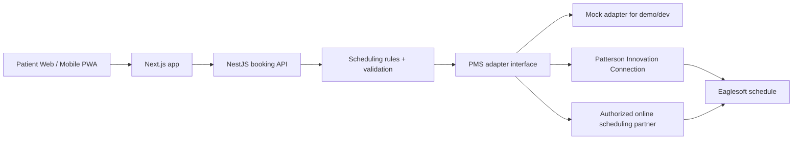

# Eaglesoft Booking Integration Plan

## Key Position

Virginia Dental Care appears to use Patterson Eaglesoft. The build should treat Eaglesoft as a practice-management system behind a secure backend boundary, not as something the public website or mobile app connects to directly.

## What Current Public Sources Support

- Patterson states Eaglesoft has "over 55 integrated, authorized solutions" and positions integration as an authorized marketplace-style capability.
- Patterson customer resources describe Patterson Innovation Connection as a controlled, secure way for authorized providers to integrate with Eaglesoft.
- Patterson support has a public "Eaglesoft Third Party Integrations" page, including an online scheduling category and a warning that some vendors have built unauthorized integrations.
- Patterson also publishes Eaglesoft Innovation Connection sample/API documentation references, which indicates an API route exists but should be handled through approved access and documentation.

Sources:

- https://www.pattersondental.com/cp/Software/dental-practice-management-software/eaglesoft
- https://www.pattersondental.com/resources/dental-software/eaglesoft-customer-resources
- https://pattersonsupport.custhelp.com/app/answers/detail/a_id/18100/~/eaglesoft-third-party-integrations
- https://pattersonsupport.custhelp.com/euf/assets/Answers/29059/Eaglesoft%20Innovation%20Connection%20Sample%20Application%20Documentation.pdf

## Recommended Architecture

## Why This Matters

- Public web/mobile code must not hold Eaglesoft credentials.
- Direct database reads or UI automation would be fragile and risky.
- The backend needs audit logs, request validation, rate limiting, and PHI controls before production.
- Appointment creation should be treated as pending until Eaglesoft confirms provider, operatory, duration, and time.

## Booking Flow

1. Patient chooses service path.
2. API asks PMS adapter for available appointment windows.
3. Patient submits minimal contact and concern details.
4. API validates request and sends it to the PMS adapter.
5. PMS adapter creates or holds the appointment through approved API/partner access.
6. API returns `PENDING_PMS_CONFIRMATION` or `CONFIRMED`.
7. Practice sends confirmation/reminder through approved communication workflow.

## Current Implementation

- `apps/api/src/modules/booking/pms/pms-integration.ts`: adapter contract.
- `apps/api/src/modules/booking/pms/mock-eaglesoft.adapter.ts`: safe demo adapter.
- `apps/api/src/modules/booking/pms/eaglesoft-pic.adapter.ts`: real integration placeholder that refuses to run without credentials and approved endpoint mapping.
- `apps/web/app/sections/booking-widget.tsx`: mobile-friendly booking UI that talks to the Nest API.

## Production Readiness Checklist

- Confirm Eaglesoft version and whether the office has Patterson Innovation Connection access.
- Confirm whether they already use Weave, YAPI, RevenueWell, Solutionreach, mConsent, or another authorized scheduling/engagement partner.
- Obtain approved API documentation, credentials, and test environment.
- Map services to Eaglesoft appointment types, provider IDs, operatories, and durations.
- Define new-patient, emergency, insurance, no-show, and buffer rules.
- Add persistent storage for booking requests and integration attempts.
- Add audit logging, rate limits, monitoring, and HIPAA-aligned operational controls.
